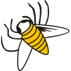

# Bee2: a cryptographic library



[](https://github.com/agievich/bee2/actions/workflows/build.yml)
[](https://scan.coverity.com/projects/agievich-bee2)
[](https://codecov.io/gh/agievich/bee2?branch=master)

## What is Bee2?

Bee2 is a cryptographic library which implements cryptographic 
algorithm and protocols standardized in Belarus. 

Bee2 fully supports the following standards 
(see [apmi.bsu.by/resources/std.html](http://apmi.bsu.by/resources/std.html)):

1. STB 34.101.31 (belt): data encryption and integrity algorithms.
2. STB 34.101.45 (bign): digital signature and key transport algorithms 
   over elliptic curves.
3. STB 34.101.47 (brng): cryptographic algorithms of pseudorandom number 
   generation + one-time passwords.
4. STB 34.101.60 (bels): secret sharing algorithms.
5. STB 34.101.66 (bake): key establishment protocols over elliptic curves. 
6. STB 34.101.77 (bash): sponge-based algorithms. 

Bee2 partially supports cryptographic mechanisms and data formats defined in 
the following standards:

7. STB 34.101.78 (bpki): a PKI profile. 
8. STB 34.101.79 (btok): cryptographic tokens. 

Additionally, Bee2 implements digital signature algorithms standardized in 
Russia and Ukraine.

## Build

```
mkdir build
cd build
cmake [-DCMAKE_BUILD_TYPE={Release|Debug|Coverage|ASan|ASanDbg|MemSan|MemSanDbg|Check}]\
      [-DBUILD_FAST=ON]\
      [-DBASH_PLATFORM={BASH_32|BASH_64|BASH_AVX2|BASH_AVX512|BASH_NEON}]\
      ..
make
[make test]
[make install]
```

> **Note**. To build on Windows you need to specify compiler and use the
compiler-specific `make` command. The following example is for the MinGW
compiler:
> ```
> mkdir build
> cd build
> cmake [-DCMAKE_BUILD_TYPE={Release|Debug|Coverage|ASan|ASanDbg|MemSan|MemSanDbg|Check}]\
>       [-DBUILD_FAST=ON]\
>       [-DBASH_PLATFORM={BASH_32|BASH_64|BASH_AVX2|BASH_AVX512|BASH_NEON}]\
>       -G "MinGW Makefiles"\
>       ..
> mingw32-make
> [mingw32-make test]
> [mingw32-make install]
> ```

Build types (`Release` by default):
   
*  `Coverage` — test coverage;
*  `ASan`, `ASanDbg` — [address sanitizer](http://en.wikipedia.org/wiki/AddressSanitizer);
*  `MemSan`, `MemSanDbg` — [memory sanitizer](http://code.google.com/p/memory-sanitizer/);
*  `Check` — strict compile rules.

The `BUILD_FAST` option (`OFF` by default) switches from safe (constant-time) 
functions to fast (non-constant-time) ones.

The `BASH_PLATFORM` option (`BASH_64` by default) requests to use a specific
implementation of the STB 34.101.77 algorithms optimized for a given hardware
platform. The request may be rejected if it conflicts with other options.

## License

Bee2 is distributed under the Apache License version 2.0. See 
[Apache 2.0](http://www.apache.org/licenses/LICENSE-2.0) or 
[LICENSE](LICENSE.txt) for details.

## Third-party code

* [whereami](https://github.com/gpakosz/whereami).

## Automated tools

Platforms:

* [Github Actions](https://github.com/agievich/bee2/actions);
* [Travis CI](https://app.travis-ci.com/github/agievich/bee2) (archived).

Static analysis:

* [Coverity Scan](https://scan.coverity.com/projects/agievich-bee2);
* [PVS-Studio](https://pvs-studio.com/en/pvs-studio/?utm_source=website&utm_medium=github&utm_campaign=open_source).

Code coverage:

* [CodeCov](https://app.codecov.io/gh/agievich/bee2?branch=master).

## Related projects

* [Bee2evp](https://github.com/bcrypto/bee2evp): an OpenSSL engine over Bee2;
* [Bee2j](https://github.com/bcrypto/bee2j): a Java wrapper over Bee2.

## What is the logo?

The logo of Bee2 is taken from a self-portrait engraving by 
[Francysk Skaryna](https://en.wikipedia.org/wiki/Francysk_Skaryna), the famous 
Belarusian medieval printer, enlightener, translator and writer. The engraving
is full of riddles, mysteries and cryptograms. One version is that a bee in the
right-bottom corner, our logo, designates the constellation known as *Apes*
(Latin for bees) in Skaryna's time. This constellation was later renamed in
*Musca Borelias* (Latin for northern fly) and then absorbed by *Aries*.

